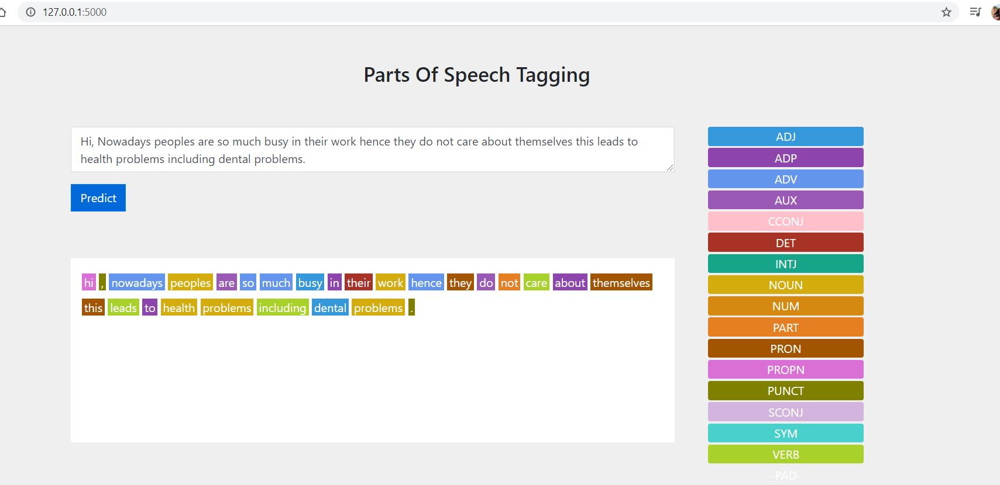

# NLP-Projects
## 1. POS Tagging using BERT
### Problem Statement:
In this project we will be performing one of the most famous task in the field of nautal language processing i,e Parts of Speech Tagging using BERT.
### Description Overview:
Part-Of-Speech tagging (POS tagging) is also called grammatical tagging or word-category disambiguation. It is the corpus linguistics of corpus Text data processing techniques for marking meaning and context.

Part-of-speech tagging can be done manually or by a specific algorithm. Using machine learning methods to implement part-of-speech tagging is the research content of Natural Language Processing (NLP). Common part-of-speech tagging algorithms include Hidden Markov Model (HMM), Conditional Random Fields (CRFs), and so on.

Part-of-speech tagging is mainly used in the field of text mining and NLP. It is a preprocessing step for various types of text-based machine learning tasks, such as semantic analysis and coreference resolution.
### Technology used: 
Anaconda Python 3.6 , Pytorch 1.4 with GPU support CUDA 10 with CuDNN 10. Install the necessary packages from requirements.txt file using the command pip install -r requirements.txt

